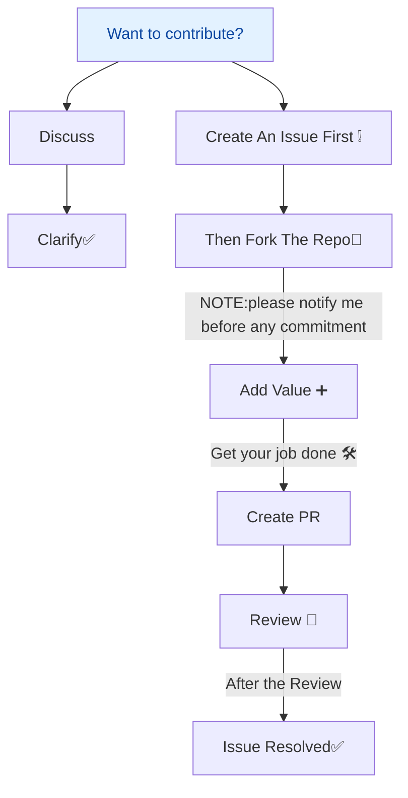

# Here is how you can contribute  🤝

----
 &nbsp;&nbsp;

----


### Contribution Flow
```txt
graph TD
Discuss --> Clarify[Clarify✅]&nbsp;
Issue[Create An Issue First ❕] --> Fork[Then Fork The Repo🍴] --> Value[Add Value ➕] --> Pr[Create PR] --> Review[After the Review] --> Done[Issue Resolved✅]
```



#### Still Confused

[Watch Online !](https://youtu.be/zTjRZNkhiEU?t=12100)
[Read Online !](https://www.freecodecamp.org/news/how-to-contribute-to-open-source-projects-beginners-guide/)
